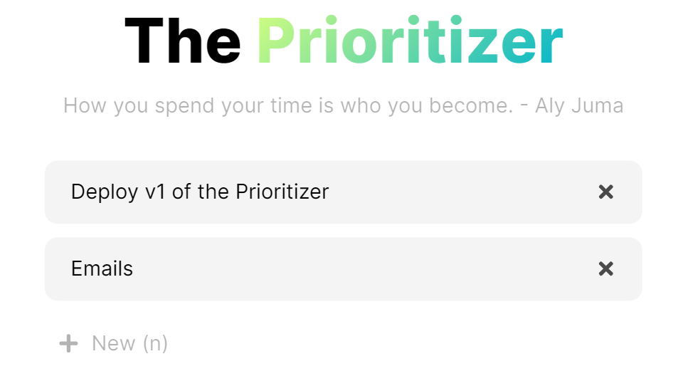
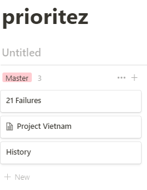
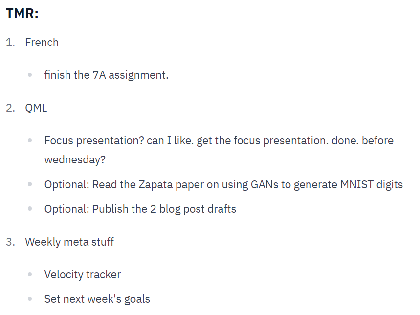

# The Prioritizer

I had struggled with time management for years. I've tried many elaborate system - from religiously timeboxing every day with pen and paper for 80 days to elaborate Notion databases to manage to-dos. I've tried used the Pomodorro technique, the Eisenhower Matrix, [daily updates](https://updately.vercel.app/@Laura-Gao-mXDtPhnMp5kCYvjnLUaYVc), and more. However, none of them had as significant of an impact as the simplest of them all.

The most traditional method is goal oriented day-planning. I want to cross things off my todo list, living my days as a robot mindlessly going through the motions of tasks I had laid out while losing the big picture of why I'm doing them. + As [Nir Eyal critiques](https://fs.blog/knowledge-project/nir-eyal/), todo lists don't allow for prioritization. To combat this, he proposes timeboxing.

You see, the root cause of my failure in time management was 1) indecisiveness and 2) discipline. The latter is beyond the scope of any time management system, but timeboxing would theoretically fix the former - if I had previously decided what I would spend my time on, then all it would take would be to execute when the time came. However, timeboxing, the environment it was set up for me, make me feel urge to make it perfect. As a perfectionist in nature, I'd so often spent 30 mins timeboxing a day when I'd change the schedule two hours later. The other problem is that I'd focus on output. I plan to work on task A for an hour and task B for the next, but oh wait one hour later task A is not done! Do I work on task B or finish task A? What if you're really on a roll with task A and you don't want to break flow state? So was the classic "timeboxer's dilemma."

Timeboxing either requires constant revision or good estimation. Yes, you can refine your strategy, but unless you wholeheartedly believe that pondering over whether to allocate 2.5 or 2 hours to sending *that cold email* is a good use of time, you'll end up half-assing the planning which ain't good for anyone. That does sound like analysis paralysis - spending so much time deciding your priorities when that time could've been spent making progress towards these very tasks.

 I don't like thinking about what I would do in the next hour, either fretting or being excited about an what's on my calendar next. I just want to focus 100% on what I'm doing now - what timeboxing and pomodorro aimed to do, but often fail at.

So.

> Themes > to-dos

> Themes > goals

Theme days worked for me. But I wanted to take it further. Why days at all? Why restrain yourself to any timespan?

Following the [rule of three](https://www.samsonzhang.com/2021/01/20/the-rule-of-three.html), I kept a running list of a maximum of 3 buckets, but often only one or two. This was done in a simple Notion dashboard that my Notion-geek friends cringe at. And I would drop all thoughts to sprint head-first at the first item on my list. And to measure productivity, it would be by input - how focused I was on what I said I would do or how much hours I put into my priorities. There is very clear what I should be doing which removes the space for excuses. 

Ususally I had ballpark of what I wanted to get done in a bucket in a day, but writing down a measurable goal just sent me into perfectionism, into perfecting the metrics. This system would take none of that. It was simple, it solves indecisivemness  - I just sprint head first on the first one, it is fast - what else could you ask for? 

My daily updates would often be based off the priorities - I would list 3 buckets and then specific tasks underneath.

Although Notion is decent, how cool would it be to build a tool just for this, a reserved space for theme-setting and theme-setting only? Todo-list, goal-setting, and timeboxing webapps exist everywhere, but I haven't ran into a bucket-fier or theme-setter or prioritizer.

So, this is my attempt at building a simple-as-heck tool to achieve the prioritization that I don't see much. The Prioritizer is where you plan out your themes, not todos.
